# Self-Driving Car Engineer Nanodegree


## Project 1: **Finding Lane Lines on the Road** 

## Write-up by Toan Luong
***
Update: Feb 2nd, 2018

The goal of this project is to identify lane lines on the road. It is a great introduction to several computer-vision techniques offered by Python OpenCV to detect road lanes. Such methods include color selection, region of interest selection, grayscaling, Gaussian smoothing, Canny Edge Detection and Hough Tranform line detection.. Obviously, this is at the very basic level with a fixed camera frame. The car does not switch lanes, have any obstruction on the road, and travel in a relatively straight path. 

This write-up consists of 3 sections: **Problem Description, Pipeline, Shortcomings and Potential Improvements**.

## 1. Problem Description

Lane finding is the foundation to autonomous driving. The difficulty lies in highlighting the lanes (no matter the intensity or paint conditions) and separating noises. Lane finding consists of multiple classic computer vision problems which are areas of active research. 
* Segmentation: we need to identify the region of interest within the camera frame where the road lanes are located. 
* Filtering: we need to highlight the lanes edges and eliminating non-lanes image noises as much as possible. 
* Lane Extrapolation: since the camera does not always capture clearly drawn, sharp, crispy lanes, we need to fit a model that connects all individual lane segments into a single lane path.

<figure>
 
 <figcaption>
 <p></p> 
 <p style="text-align: center;"> Lane segments before extrapolation </p> 
 </figcaption>
</figure>
 <p></p> 
<figure>
 
 <figcaption>
 <p></p> 
 <p style="text-align: center;"> Lane segments after extrapolation</p> 
 </figcaption>
</figure>

For this project, Udacity utilized the **moviepy.editor** package to process VideoFileClip and convert them into individual image frames for analyses. We are testing on image frames from the 2 videos below. Both cars are travelling on straight lanes, but one video the car is driving next to a yellow lane. 

<video width="350" height="240" controls src="test_videos/solidWhiteRight.mp4"></video>
<video width="350" height="240" controls src="test_videos/solidYellowLeft.mp4"></video>

There is a challenge video. But we will tackle this after learning more advanced lane-finding techniques that involve calculating road curvatures and fitting more complicated models.

<video width="350" height="240" controls src="test_videos/challenge.mp4"></video>

The goal is to get something like this.

<video width="350" height="240" controls src="examples/P1_example.mp4"></video>

## 2. Pipeline

Let's get all the packages in. For this basic task, our main package is cv2 which is C++-implemented but Python-wrapped OpenCV library that is famous for computer vision problems. My goal is to explore <a href="https://docs.opencv.org/master/d9/df8/tutorial_root.html">official tutorials</a> and attempt this book/Github <a href="https://github.com/PacktPublishing/Mastering-OpenCV3-Second-Edition">exercises</a> about OpenCV3.


```python
import matplotlib.pyplot as plt
import matplotlib.image as mpimg
import numpy as np
import math
import cv2
from moviepy.editor import VideoFileClip
from IPython.display import HTML
%matplotlib inline
```

I'll define a bunch of helper functions and will explain the code later


```python
def grayscale(img):
    """
    Applies the Grayscale transform. Convert an image from 3 channels to 1 channel
    """
    return cv2.cvtColor(img, cv2.COLOR_RGB2GRAY)

def get_yellow_mask_HLS(img):
    """
    Filter for yellow-color pixels. Set others to black
    """
    return cv2.inRange(img, np.array([15, 38, 115]), np.array([35, 204, 255])) # Lower yellow, upper yellow                       

def get_white_mask_HLS(img):  
    """
    Filter for white-color pixels. Set others to black
    """
    return cv2.inRange(img, np.array([200, 200, 200]), np.array([255, 255, 255])) # Lower white, upper white 

def filter_white_yellow(img, show=False):
    """
    Convert an image to HLS. Filter based on the two color masks: white and yellow
    """
    img_HLS = cv2.cvtColor(img, cv2.COLOR_RGB2HLS)
    yellow_mask_HLS = get_yellow_mask_HLS(img_HLS) # Only return the yellow-range pixels
    white_mask_HLS  = get_white_mask_HLS(img)  # Only return the white-range pixels
    combined_mask_HLS = yellow_mask_HLS + white_mask_HLS # Combine the two masks
    detected = cv2.bitwise_and(img, img, mask=combined_mask_HLS)
    if show:
        plt.figure(figsize=(16,6))
        plt.subplot(2,2,1).set_title("Original image")
        plt.imshow(img)
        plt.axis('off')
        plt.subplot(2,2,2).set_title("Filter for yellow only")
        plt.imshow(yellow_mask_HLS,cmap='gray')
        plt.axis('off')
        plt.subplot(2,2,3).set_title("Filter for white only")
        plt.imshow(white_mask_HLS, cmap='gray')
        plt.axis('off')
        plt.subplot(2,2,4).set_title("Filter for both white and yellow")
        plt.imshow(combined_mask_HLS, cmap='gray')
        plt.axis('off')
    return detected

def canny(img, low_threshold, high_threshold):
    """
    Applies the Canny Edge transform
    """
    return cv2.Canny(img, low_threshold, high_threshold)

def gaussian_blur(img, kernel_size):
    """
    Applies a Gaussian Noise kernel
    """
    return cv2.GaussianBlur(img, (kernel_size, kernel_size), 0)

def get_vertices(img, bottom_width = 0.85, top_width = 0.07, height_prop = 0.4):
    """
    Return vertices that define the polygon where the lanes are. 
    Top and bottom edges of trapezoid are expressed as percentage of image width.
    Height of the trapezoid expressed as percentage of image height.
    Measurements are suggested by @georgesung
    """
    imshape = img.shape
    vertices = np.array([[\
        ((imshape[1] * (1 - bottom_width)) // 2, imshape[0]),\
        ((imshape[1] * (1 - top_width)) // 2, imshape[0] - imshape[0] * height_prop),\
        (imshape[1] - (imshape[1] * (1 - top_width)) // 2, imshape[0] - imshape[0] * height_prop),\
        (imshape[1] - (imshape[1] * (1 - bottom_width)) // 2, imshape[0])]], dtype=np.int32)
    return vertices
                         
def region_of_interest(img, vertices):
    """
    Given a set of polygon vertices, apply an image mask, keep the region of the image defined by the polygon
    The rest of the image is set to black.
    """
    # Define a black mask
    mask = np.zeros_like(img)   
    
    # Define a 3 channel or 1 channel color to fill the mask with depending on the input image
    if len(img.shape) > 2:
        channel_count = img.shape[3]
        ignore_mask_color = (255,) * channel_count
    else:
        ignore_mask_color = 255
        
    # Fill pixels inside the polygon defined by "vertices" with the fill color    
    cv2.fillPoly(mask, vertices, ignore_mask_color)

    # Return the image only where mask pixels (inside the ROI) are nonzero
    masked_image = cv2.bitwise_and(img, mask)
    return masked_image
    
def draw_roi(orig_img, vertices, color=[0,255,0]):
    """
    Draw the Region Of Interest. As defined by the vertices.
    """
    image_copy = np.copy(orig_img)
    cv2.polylines(image_copy,[vertices], True, color, 5)
    return image_copy
    
def draw_lanes(img, lines, height_prop, color=[255, 0, 0], thickness=10):
    """
    Extrapolate the line segments you detect to map out the full
    extent of the lane using a linear fit.  
    """
    draw_left = True
    draw_right = True
    
    left_lines = []
    right_lines = []
    for line in lines:
        for x1,y1,x2,y2 in line:
            grad = (y2 - y1) / (x2 - x1)
            if np.isnan(float(grad)):
                continue
            if abs(grad) > 0.3:
                if grad < 0:
                    left_lines.append(line)
                else:
                    right_lines.append(line)
             
    if len(left_lines) == 0:
        draw_left = False
    if len(right_lines) == 0:
        draw_right = False
    
    x_left_coors = []
    y_left_coors = []
    x_right_coors = []
    y_right_coors = []
    
    for line in left_lines:
        for x1,y1,x2,y2 in line:
            x_left_coors.append(x1)
            x_left_coors.append(x2)
            y_left_coors.append(y1)
            y_left_coors.append(y2)
    for line in right_lines:
        for x1,y1,x2,y2 in line:
            x_right_coors.append(x1)
            x_right_coors.append(x2)
            y_right_coors.append(y1)
            y_right_coors.append(y2)
    
    if draw_left:
        m_left, b_left = np.polyfit(x_left_coors, y_left_coors, 1)
    else:
        m_left, b_left = 1, 1
        
    if draw_right:
        m_right, b_right = np.polyfit(x_right_coors, y_right_coors, 1)
    else:
        m_right, b_right = 1, 1
    
    imshape = img.shape
    y_bottom = imshape[0]
    y_top = imshape[0] * (1 - height_prop)
    
    x_left_bottom = (y_bottom - b_left) / (m_left)
    x_right_bottom = (y_bottom - b_right) / (m_right)
    x_left_top = (y_top - b_left) / (m_left)
    x_right_top = (y_top - b_right) / (m_right)
    
    if draw_left: 
        cv2.line(img, (int(x_left_bottom), int(y_bottom)), (int(x_left_top), int(y_top)), color, thickness)
    if draw_right:
        cv2.line(img, (int(x_right_bottom), int(y_bottom)), (int(x_right_top), int(y_top)), [0,0,255], thickness)

def hough_lines(img, rho, theta, threshold, min_line_len, max_line_gap, height_prop=0.4):
    """
    Return an image with Hough lines drawn.
    """
    lines = cv2.HoughLinesP(img, rho, theta, threshold, np.array([]), minLineLength=min_line_len, maxLineGap=max_line_gap)
    line_img = np.zeros((img.shape[0], img.shape[1], 3), dtype=np.uint8)
    draw_lanes(line_img, lines, height_prop)
    return line_img

def weighted_img(annotations, initial_img, α=0.8, β=1., γ=0.):
    """
    Return an annotated image frame, we can also add weights to modify intensity of 2 layers. 
    The result image is computed as follows: initial_img * α + img * β + γ
    """
    return cv2.addWeighted(initial_img, α, annotations, β, γ)

def draw_dashboard(final_img, roi_img, blurred_img, canny_img):
    """
    Provide inside-the-head view of what the car "sees". Code by @nicholasio
    """
    snapshot1 = cv2.resize(roi_img, (300,200))
    snapshot2 = cv2.resize(blurred_img, (300,200))
    snapshot3 = cv2.resize(canny_img,(300,200))
    final_img[:200,:300] = snapshot1
    final_img[0:200,305:605] = snapshot2
    final_img[0:200,610:910] = cv2.cvtColor(snapshot3,cv2.COLOR_GRAY2RGB)
    return final_img
```

Ok, let's test them out.

### Read and display an image frame

All images should be of dimension (540x960) with 3 color channels as RGB.


```python
sample_image = mpimg.imread('test_images/solidWhiteRight.jpg')
print('This image is:', type(sample_image), 'with dimensions:', sample_image.shape)
plt.imshow(sample_image)
plt.show()
```

    This image is: <class 'numpy.ndarray'> with dimensions: (540, 960, 3)


### Define the region of interest

Let's draw out the area that we would like to identify lanes. The function *get_vertices()* takes in 3 measures: top_width, bottom_width, and height which are scaled according to the image. The formula can be thought as below. Notice that we are not operating as [row, col] of np.array but [x, y] based on OpenCV plane coordinates.

* We define the horizontal axis, $x=shape[1]$ and vertical axis $y=shape[0]$ 
* For the bottom left point: $$\frac{x*(1-w_{bottom})}{2}, y$$
* For the bottom right point coordinate: $$x-\frac{x*(1-w_{bottom})}{2}, y$$
* For the top left point coordinate: $$\frac{x*(1-w_{top})}{2}, y*(1-p_{height})$$
* For the top right point coordinate: $$x - \frac{x*(1-w_{top})}{2}, y*(1-p_{height})$$

The order we define the polygon coordinates have to be clockwise. bottom-left, top-left, top-right, bottom-right. 
```python
cv2.polylines(img=image_copy, pts=[vertices], isClosed=True, color=[0,0,255], thickness=3)
```

As we can see below, the polygon captures the center region of the image frame. Obviously, this is a huge shortcoming because the lanes can easily fall out of the drawn region, once the car shifts its direction. 


```python
plt.imshow(draw_roi(sample_image, get_vertices(sample_image)))
plt.show()
```


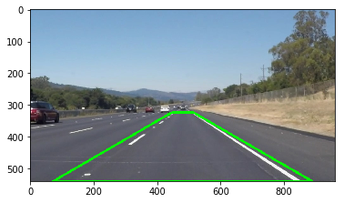


### Filter

Assuming the lanes are only white and yellow, our job is to filter the image for the white-color and yellow-color pixels.

To achieve that we need the 4 openCV methods as shown below.
* We need to convert the RGB color code to HLS (Hue, Saturation, Lightness) so that color segmentation can be more successful. Read  <a href="https://stackoverflow.com/questions/17063042/why-do-we-convert-from-rgb-to-hsv">this</a>. Essentially, the RGB pixels are heavily correlated because of the amount of light hitting the objects. Converting to HLS accounts for such effect.
* We use *cv2.inRange* to keep the pixels within the "yellow" and "white" range. The below color ranges are suggested by @georgesung and they can be tuned as hyperparamters

```python
cv2.cvtColor(img, cv2.COLOR_RGB2GRAY)
cv2.cvtColor(img, cv2.COLOR_RGB2HLS)
# Lower yellow, upper yellow
cv2.inRange(img, np.array([15, 38, 115]), np.array([35, 204, 255]))
# Lower white, upper white 
cv2.inRange(img, np.array([200, 200, 200]), np.array([255, 255, 255]))
# Combine the two masks
combined_mask_HLS = yellow_mask_HLS + white_mask_HLS
# Apply the two masks to the originial image, maintaining the 3D array structure
cv2.bitwise_and(img, img, mask=combined_mask_HLS)
```

As we can see, the results are pretty astonishing. That the yellow lane on the left are identified (top right). The white dotted lanes on the right and tiny bits of the car are captured (bottom left).


```python
yellow_image = mpimg.imread('test_images/solidYellowCurve.jpg')
filtered = filter_white_yellow(yellow_image, show=True)
```


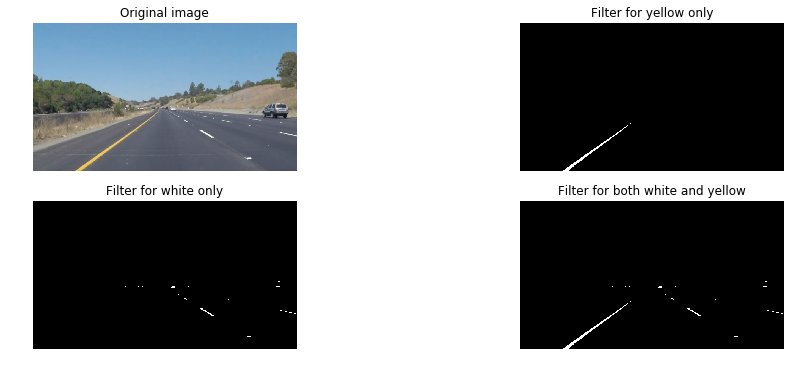


### Gaussian Blur and Canny Edge Detection 

Watch <a href="https://www.youtube.com/watch?v=17cOHpSaqi0">this</a> from Udacity's Computational Photography to understand those techniques.

Essentially, for Gaussian Blur, we do a linear transformation by attach a filter weights. In this case, the filter weights give more values or highlight the center parts. Toward the edges, it is a linear combination with close-to-zero numbers so it will be blurred. This step is sort of *normalizing* the features matrix so to prevent any image pixels/areas overwhelm the model or add noise to the relevant parts. 

For Canny Edge Detection, it highlight the edges of the an image. What is an edge? It is the boundaries between pixels where is a large change in values (go from bright → dark and vice versa). The goal is to improve from the gradient-magnitude representation.
* Wherever we see strong whites (large gradients) we continue to smooth/apply/fill at that large range with nearby smaller whites (lower gradients). So that we can highlight the edges with the whitest marks (high pixel values).
* High threshold is to signal where to start the edge curves as we highlight and extract the local information.
* Low threshold is to signal where to apply smoothing and continue the edge curves from other high-gradient areas. 

In this case, we set our blur kernel to be 5, low threshold to be 50, high threshold to be 150. Read more about kernel <a href="https://computergraphics.stackexchange.com/questions/39/how-is-gaussian-blur-implemented">here</a>. Basically, it is the size of the scanning patch where we perform dot products or the radius of the blur. The larger the kernel, the more expensive the operation.

The results are shown below.


```python
blurred = gaussian_blur(filtered, 5)
edges = canny(blurred, 50, 150)

plt.figure(figsize=(16,6))
plt.subplot(2,2,1).set_title("Original image")
plt.imshow(yellow_image)
plt.axis('off')
plt.subplot(2,2,2).set_title("Filter for both white and yellow")
plt.imshow(filtered,cmap='gray')
plt.axis('off')
plt.subplot(2,2,3).set_title("After Gaussian Blur")
plt.imshow(blurred, cmap='gray')
plt.axis('off')
plt.subplot(2,2,4).set_title("After Canny Edge Detection")
plt.imshow(edges, cmap='gray')
plt.axis('off')
```


    (-0.5, 959.5, 539.5, -0.5)


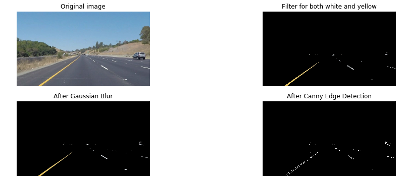


### Hough Transforms and Draw Basic Lines

Read <a href="https://alyssaq.github.io/2014/understanding-hough-transform/">this</a> for more detailed explanations. 

**cv2.HoughLinesP** takes in a Canny edges as input (bottom right of previous cell) and produces a set of coordinates (x1,y1) and (x2,y2).

The we for-loop through and use **cv2.line** to draw them on an empty canvas.

The results are great but the lanes are disconnected which are not what we want.


```python
low_threshold = 50
high_threshold = 150
kernel_size = 5
rho = 1 
theta = np.pi/180
threshold = 15 
min_line_len = 10
max_line_gap = 20 

import glob
test_images_link = glob.glob("test_images/*")

for i, image_link in enumerate(test_images_link):
    input_image = mpimg.imread(image_link)
    gray_filtered = filter_white_yellow(input_image)
    blur_gray = gaussian_blur(gray_filtered, kernel_size)
    edges = canny(blur_gray, low_threshold, high_threshold)
    masked_edges = region_of_interest(edges, get_vertices(edges))
    lines = cv2.HoughLinesP(masked_edges, rho, theta, threshold, np.array([]), minLineLength=min_line_len, maxLineGap=max_line_gap)
    canvas = np.zeros((yellow_image.shape[0], yellow_image.shape[1], 3), dtype=np.uint8)
    for line in lines:
        for x1, y1, x2, y2 in line:
            cv2.line(canvas, (x1, y1), (x2, y2), color=[255,0,0], thickness=5)
    drawn_image = cv2.addWeighted(input_image, 0.8, canvas, 1, 0)
    plt.figure(figsize=(15,20))
    plt.subplot(6,2,1).set_title(image_link)
    plt.imshow(input_image)
    plt.axis('off')
    plt.subplot(6,2,2).set_title("After Drawing Lanes")
    plt.imshow(drawn_image)
    plt.axis('off')
```


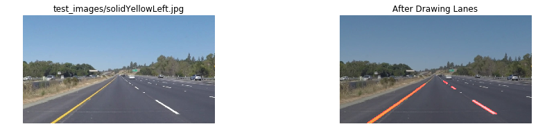


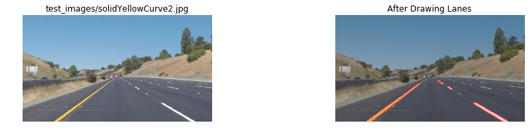


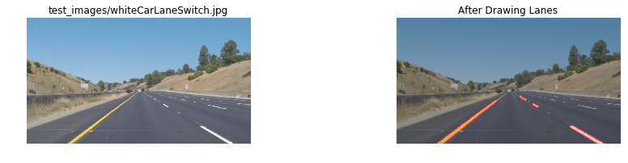


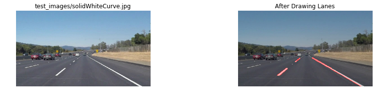


### Extrapolate Lane Lines 

Our input is a canvas of Canny edges with only pixels from the Region of Interest as defined above that contains the road lanes. Just as the previous step, from this canvas, we perform Hough Transforms and obtain a set of pair coordinates (x1, y1) and (x2, y2) which represent the lane edges. If we draw a line connecting every single pair, we have disconnected lanes.

So, what do we do? This is the strategy. Think about the y and x coordinates as two separate clouds of points. We "sort of" average all the lines and extract the best-fit gradient and intercept that best describe the right and left lanes. 

Please refer to the function ```draw_lanes()``` in the Helper zone up top. But here are the list of steps.
* Separate the list of lines into left-slope and right-slope lines. Eliminate all lines with abs(slope) < 0.5. Left lanes have gradient < 0 and right lanes have gradient > 0.
* Collect all x-coordinates and y-coordinates into 2 separate lists. Because np.polyfit() requires so. 
* After polyfit, a single gradient and intercept will come out. For the left and for the right.
* The only coordinates we know for sure are the **y-coordinates**. 
* At the bottom is $y_1 = img.shape[0]$ and at the top is $y_2 = (img.shape[0] - 1*height)$. And these are the same for right and left lanes
* We then use the slopes and intercept to extrapolate the x-coordinates $x_1$ and $x_2$ using $x=\frac{y-b}{m}$. And pinpoint exactly the two points. But $x_1$ and $x_2$ will be different for right and left lanes and dependent on the gradient $m_{left}, b_{left}$ and $m_{right}, b_{right}$
* Obviously, we have to account for the situation that within the Hough quartet of 4 coordinates, there is a $x_1-x_2 = 0$ which makes the gradient calculation NA.
* Also, the algorithm have to make sure there are coordinates in the left_lanes and right_lanes arrays before attempting polyfit(). If there is no point to fit, the gradient and intercept for that lane is set as 1 and 1.


```python
low_threshold = 50
high_threshold = 150
kernel_size = 11
rho = 1 
theta = np.pi/180
threshold = 15 
min_line_len = 10
max_line_gap = 20 

import glob
test_images_link = glob.glob("test_images/*")

for i, image_link in enumerate(test_images_link):
    input_image = mpimg.imread(image_link)
    gray_filtered = filter_white_yellow(input_image)
    blur_gray = gaussian_blur(gray_filtered, kernel_size)
    edges = canny(blur_gray, low_threshold, high_threshold)
    masked_edges = region_of_interest(edges, get_vertices(edges))
    canvas = hough_lines(masked_edges, rho, theta, threshold, min_line_len, max_line_gap)
    drawn_image = cv2.addWeighted(input_image, 0.8, canvas, 1, 0)
    plt.figure(figsize=(15,20))
    plt.subplot(6,2,1).set_title(image_link)
    plt.imshow(input_image)
    plt.axis('off')
    plt.subplot(6,2,2).set_title("After Drawing Lanes")
    plt.imshow(drawn_image)
    plt.axis('off')
```


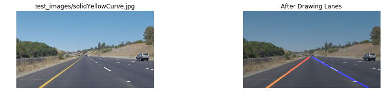


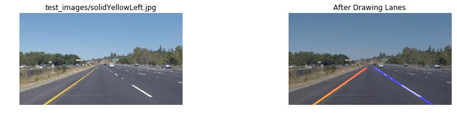


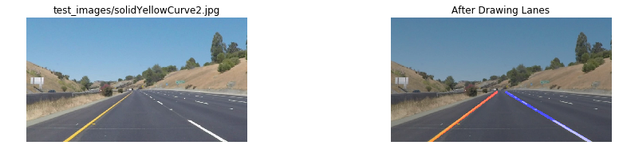


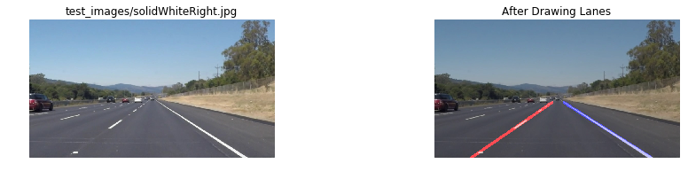


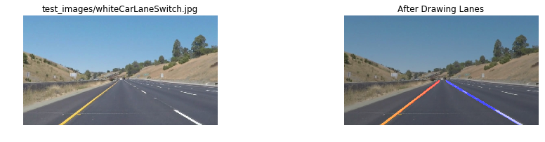


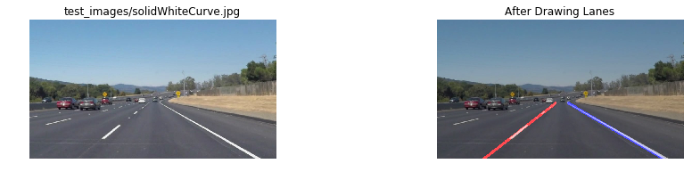


### Perform Test on Videos

We put the whole pipeline into a single function ```process_image()``` where we can define the 11 hyperparameters as below. The values that I have here is from my own experiments and fellow Udacity classmates.


```python
# ROI
bottom_width = 0.85 
top_width = 0.07
height_prop = 0.4

# Gaussian Blur and Canny
kernel_size = 11
low_threshold = 50
high_threshold = 150

# Hough Transformation
rho = 1 # distance resolution in pixels of the Hough grid
theta = np.pi/180 # angular resolution in radians of the Hough grid
threshold = 15 # minimum number of votes (intersections in Hough grid cell)
min_line_len = 10 # minimum number of pixels making up a line
max_line_gap = 20 # maximum gap in pixels between connectable line segments
```


```python
def process_image(input_image, bottom_width, top_width, height_prop,
                  kernel_size, low_threshold, high_threshold,
                  rho, theta, threshold, min_line_len, max_line_gap,
                  show_annotations=False, with_dashboard=False):
    # Filter for white and yellow
    gray_filtered = filter_white_yellow(input_image)
    
    # Apply Gaussian smoothing
    blur_gray = gaussian_blur(gray_filtered, kernel_size)
    
    # Canny
    edges = canny(blur_gray, low_threshold, high_threshold)

    # Define a four sided polygon to detect lanes.
    masked_edges = region_of_interest(edges, get_vertices(edges))
    
    # Run Hough on edge detected image.
    line_image = hough_lines(masked_edges, rho, theta, threshold, min_line_len, max_line_gap, height_prop)

    # Draw the lines on the original image.
    lines_edges = weighted_img(line_image, input_image)
    
    if with_dashboard:
        return draw_dashboard(lines_edges, draw_roi(input_image, get_vertices(input_image)), gray_filtered, masked_edges)

    return lines_edges
```

### Dashboard

Inspired from classmates on Slack, I implemented an insight look into the car's "eyes" to view what it observes as the image frame changes.
* Frame 1 is original frame with region of interest drawn
* Frame 2 is after filtering yellow and white
* Frame 3 is Canny edge


```python
import glob
test_images_link = glob.glob("test_images/*")

for i, image_link in enumerate(test_images_link):
    input_image = mpimg.imread(image_link)
    drawn_image = process_image(input_image, bottom_width, top_width, height_prop,
                  kernel_size, low_threshold, high_threshold,
                  rho, theta, threshold, min_line_len, max_line_gap,
                  show_annotations=False, with_dashboard=True)
    plt.figure(figsize=(15,20))
    plt.subplot(6,2,1).set_title(image_link)
    plt.imshow(input_image)
    plt.axis('off')
    plt.subplot(6,2,2).set_title("After Drawing Lanes")
    plt.imshow(drawn_image)
    plt.axis('off')
```


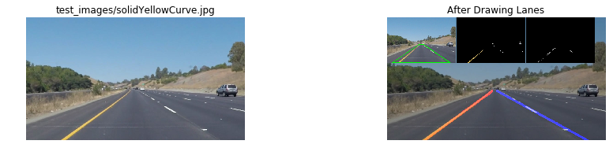


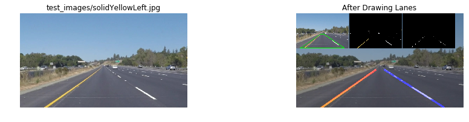


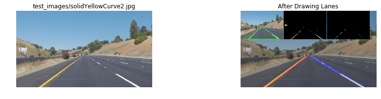


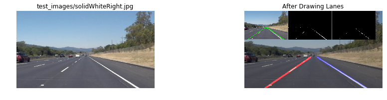


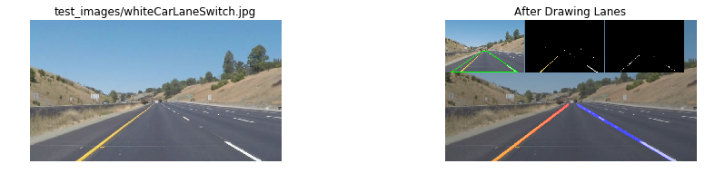


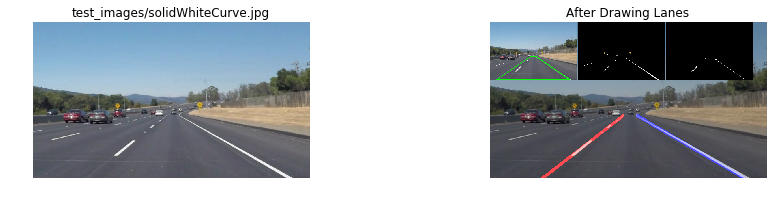


### With White Lanes Only


```python
def for_video(image):
    return process_image(image, bottom_width, top_width, height_prop,
                         kernel_size, low_threshold, high_threshold, 
                         rho, theta, threshold, min_line_len, max_line_gap, 
                         with_dashboard=True)
```


```python
white_output = 'test_videos_output/solidWhiteRight.mp4'
clip1 = VideoFileClip("test_videos/solidWhiteRight.mp4")
white_clip = clip1.fl_image(for_video)
%time white_clip.write_videofile(white_output, audio=False)
```

    [MoviePy] >>>> Building video test_videos_output/solidWhiteRight.mp4
    [MoviePy] Writing video test_videos_output/solidWhiteRight.mp4


    100%|█████████▉| 221/222 [00:03<00:00, 57.73it/s]


    [MoviePy] Done.
    [MoviePy] >>>> Video ready: test_videos_output/solidWhiteRight.mp4 
    
    CPU times: user 5.2 s, sys: 188 ms, total: 5.39 s
    Wall time: 4.03 s


```python
HTML("""
<video width="960" height="540" controls>
  <source src="{0}">
</video>
""".format(white_output))
```


<video width="960" height="540" controls>
  <source src="test_videos_output/solidWhiteRight.mp4">
</video>


### With Yellow and White Lanes


```python
yellow_output = 'test_videos_output/solidYellowLeft.mp4'
clip2 = VideoFileClip('test_videos/solidYellowLeft.mp4')
yellow_clip = clip2.fl_image(for_video)
%time yellow_clip.write_videofile(yellow_output, audio=False)
```

    [MoviePy] >>>> Building video test_videos_output/solidYellowLeft.mp4
    [MoviePy] Writing video test_videos_output/solidYellowLeft.mp4


    100%|█████████▉| 681/682 [00:12<00:00, 53.59it/s]


    [MoviePy] Done.
    [MoviePy] >>>> Video ready: test_videos_output/solidYellowLeft.mp4 
    
    CPU times: user 16.8 s, sys: 515 ms, total: 17.4 s
    Wall time: 13 s


```python
HTML("""
<video width="960" height="540" controls>
  <source src="{0}">
</video>
""".format(yellow_output))
```


<video width="960" height="540" controls>
  <source src="test_videos_output/solidYellowLeft.mp4">
</video>


## 3. Shortcomings and Potential Improvements.

Obviously, the algorithm works well on the above 2 videos because we shape our algorithm accoring to the following constraints:
* White and yellow lanes only
    * This can go wrong if the car travels on a poorly defined roads
* Camera frame remains fixed that the lanes are at the center
    * This can go wrong if the car goes off track and faces obstacles. Or the camera captures a different frame.
* Lanes are straight
    * The algorithm will fail if the car travels on a curve road. This shortcoming is shown clearly in the challenge video below. 
    
Potential improvements can include:
* Incorporate lane curvatures in the algorithm. I believe we will learn this in later lessons.
* Dynamically change the Region Of Interest Polygon. As shown in the video, the algorithm assumes a fixed trapezoid frame 


```python
challenge_output = 'test_videos_output/challenge.mp4'
clip3 = VideoFileClip('test_videos/challenge.mp4')
challenge_clip = clip3.fl_image(for_video)
%time challenge_clip.write_videofile(challenge_output, audio=False)
```

    [MoviePy] >>>> Building video test_videos_output/challenge.mp4
    [MoviePy] Writing video test_videos_output/challenge.mp4


    100%|██████████| 251/251 [00:07<00:00, 32.01it/s]


    [MoviePy] Done.
    [MoviePy] >>>> Video ready: test_videos_output/challenge.mp4 
    
    CPU times: user 10.7 s, sys: 318 ms, total: 11 s
    Wall time: 8.36 s


```python
HTML("""
<video width="960" height="540" controls>
  <source src="{0}">
</video>
""".format(challenge_output))
```


<video width="960" height="540" controls>
  <source src="test_videos_output/challenge.mp4">
</video>


